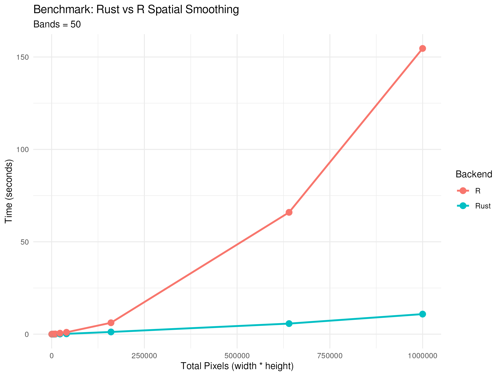
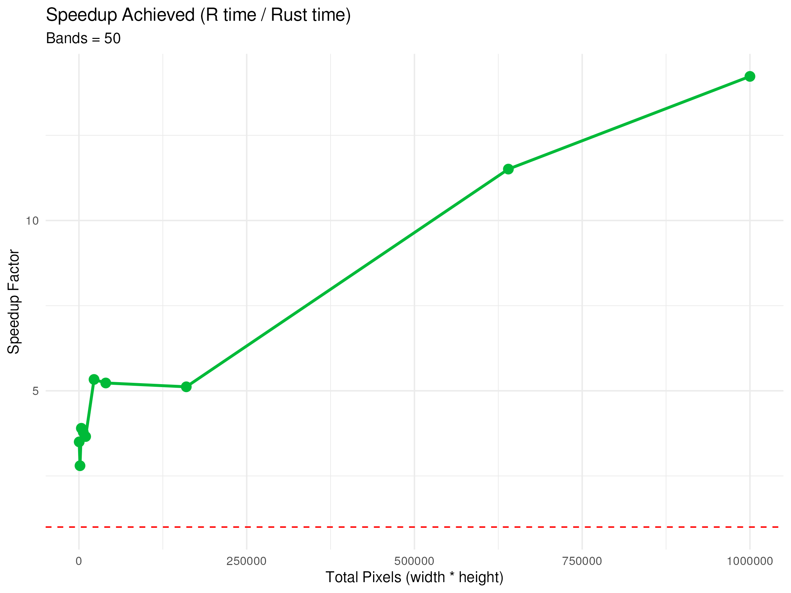

```{r, include = FALSE}
knitr::opts_chunk$set(
  collapse = TRUE,
  comment = "#>"
)
```

## Introduction

The `hySpc.hpc` package offers two backends for spatial smoothing of hyperspectral images:
1.  **R**: The native R implementation.
2.  **Rust**: A highly optimized Rust backend leveraging `faer` for sparse linear algebra and `rayon` for parallel processing.

This vignette details the performance differences between the two backends across various image sizes.

## Methodology

We benchmarked the `graphSmooth()` function using both backends on a range of mock hyperspectral image sizes (from 400 pixels to 1,000,000 pixels), all with 50 wavelength bands.

*   **Alpha:** 1.0
*   **Neighbors:** 4

## Results

### Execution Time

As the size of the hyperspectral image increases, the execution time for both backends grows. However, the Rust backend is consistently faster.

```{r out.width="100%", echo=FALSE}

```

### Speedup Factor

The speedup factor is calculated as the time taken by the R backend divided by the time taken by the Rust backend. A speedup of 5 means the Rust backend is 5 times faster than the R backend.

```{r out.width="100%", echo=FALSE}

```

## Conclusion

The Rust backend provides significant performance improvements over the native R implementation, particularly as the size of the dataset increases. For large hyperspectral images (e.g., 1,000,000 pixels), the Rust backend achieves a speedup factor of over 14x. We highly recommend using the Rust backend for any computationally intensive spatial smoothing tasks.
