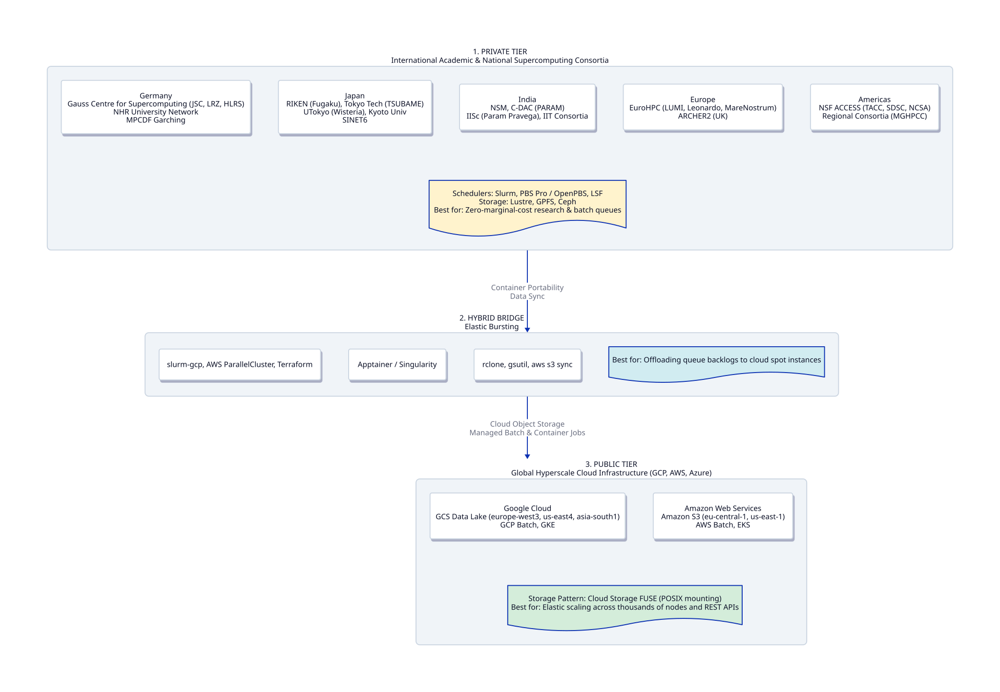

```{r, include = FALSE}
knitr::opts_chunk$set(
  collapse = TRUE,
  comment = "#>"
)
```

## Introduction

The `hySpc.hpc` package derives its "High-Performance" name from its ability to dramatically accelerate spatial smoothing operations on hyperspectral images. It achieves this by bridging R with Rust, utilizing self-contained Krylov matrix-vector kernels (`csc_matvec`) for fast CG/BiCGSTAB solvers, `faer` for sparse linear algebra, and the `rayon` crate for multi-threaded parallel execution.

However, `hySpc.hpc` is fundamentally an **intra-node accelerator**: it saturates all available CPU cores *on a single physical machine* to smooth across multiple wavelength bands simultaneously.

When processing large-scale spectral campaigns—such as thousands of Raman maps, FTIR field scans, or remote sensing cubes—computational spectroscopy demands an **inter-node architecture**. This guide details how to orchestrate `hySpc.hpc` across a three-tiered international infrastructure landscape:

1. **Global Institutional & National Supercomputing Consortia**: Academic and national research facilities across Germany, Japan, India, Europe, and the Americas:
   * **Germany**: The Gauss Centre for Supercomputing (**GCS**) comprising **JSC Jülich** (JUPITER/JUWELS), **LRZ Garching/Munich** (SuperMUC-NG), and **HLRS Stuttgart** (Hawk), alongside the National High Performance Computing (**NHR**) university alliance and **MPCDF** (Max Planck).
   * **Japan**: **RIKEN R-CCS** (Fugaku), **Tokyo Tech** (TSUBAME), **University of Tokyo ITC** (Wisteria/BDEC-01), **Kyoto University ACCMS**, and the **SINET6** network.
   * **India**: The **National Supercomputing Mission (NSM)**, **C-DAC** (PARAM Siddhi-AI, PARAM Brahma), **IISc Bangalore** (Param Pravega), and the **IIT** consortia.
   * **Europe-wide**: **EuroHPC Joint Undertaking** (LUMI, Leonardo, MareNostrum) and **ARCHER2** (UK).
   * **Americas**: **NSF ACCESS** (TACC Frontera, SDSC Expanse, NCSA Delta) and regional consortia like **MGHPCC** in Massachusetts (MIT Engaging, Harvard FASRC, UMass Unity, BU SCC).
2. **Public Cloud Data Centers**: Google Cloud Platform (**GCP**), Amazon Web Services (**AWS**), and Microsoft Azure utilizing object storage data lakes and serverless batch computing.
3. **The Hybrid Bridge**: Slurm/PBS/OpenPBS cloud bursting, Apptainer/Singularity container portability, and provenance capture via `provBookR`.

---

## 1. The Global Landscape of Compute

<p align="center">
  
</p>

---

## 2. Intra-Node vs. Inter-Node Parallelism

When scaling hyperspectral processing, you are coordinating two distinct layers of parallelism:

1. **Inner Loop (Rust / Rayon):** `hySpc.hpc` distributes the smoothing of $k$ distinct wavelength bands across the CPU cores available on the executing node.
2. **Outer Loop (Slurm / PBS / Cloud Batch):** A job scheduler distributes $N$ distinct hyperspectral image cubes across multiple compute nodes.

> **CRITICAL: The Nested Parallelism Trap**
> If a supercomputing node allocates 4 or 8 CPU cores to an R worker, but Rust's `rayon` detects a physical 64-core or 128-core motherboard (common on JSC, LRZ, or RIKEN nodes), Rayon will attempt to spawn threads for every physical core. When multiple R workers share a node, this creates severe CPU oversubscription. You **must** set `RAYON_NUM_THREADS` explicitly inside each worker task to match the allocated slot count.

---

## 3. Private Tier: Institutional HPC Consortia

Whether running across German centers (**JSC Jülich, LRZ Munich, HLRS**), Japanese national systems (**RIKEN, TSUBAME**), Indian facilities (**C-DAC, IISc**), or North American consortia (**MGHPCC, NSF ACCESS**), jobs are standardly managed by schedulers like **Slurm** or **PBS Professional**.

Using R's `future` and `future.batchtools` ecosystem, R users can submit distributed workloads across these international clusters without rewriting core analytical code.

### Slurm Configuration (`slurm-cluster.tmpl`)

For Slurm-managed environments (standard across JSC, LRZ, MGHPCC, TACC, and EuroHPC):

```bash
#!/bin/bash
#SBATCH --job-name=<%= job.name %>
#SBATCH --output=<%= log.file %>
#SBATCH --error=<%= log.file %>
#SBATCH --ntasks=1
#SBATCH --cpus-per-task=<%= resources$ncpus %>
#SBATCH --mem-per-cpu=<%= resources$memory %>
#SBATCH --time=<%= resources$walltime %>
#SBATCH --partition=<%= resources$partition %>

module load R
Rscript -e 'batchtools::doJobCollection("<%= uri %>")'
```

### PBS Professional Configuration (`pbs-cluster.tmpl`)

For PBS/OpenPBS-managed environments (frequently deployed across C-DAC PARAM facilities and Japanese university centers):

```bash
#!/bin/bash
#PBS -N <%= job.name %>
#PBS -o <%= log.file %>
#PBS -e <%= log.file %>
#PBS -l select=1:ncpus=<%= resources$ncpus %>:mem=<%= resources$memory %>mb
#PBS -l walltime=<%= resources$walltime %>
#PBS -q <%= resources$queue %>

cd $PBS_O_WORKDIR
module load R
Rscript -e 'batchtools::doJobCollection("<%= uri %>")'
```

### R Dispatch Script

```{r eval=FALSE}
library(future.batchtools)
library(future.apply)
library(hyperSpec)
library(hySpc.hpc)

# Define compute resources matching institutional queue limits
# (e.g., JSC 'batch', LRZ 'mpp3', MIT 'sched_mit_hill', TACC 'normal')
resources <- list(
  ncpus = 8,
  memory = 4000,          # 4 GB per core = 32 GB total
  walltime = "02:00:00",
  partition = "standard"  # e.g., 'batch', 'gpu', 'compute', 'standard'
)

# Configure the future plan (select template based on cluster scheduler)
plan(batchtools_slurm, template = "slurm-cluster.tmpl", resources = resources)
# Or for PBS systems:
# plan(batchtools_custom, template = "pbs-cluster.tmpl", resources = resources)

# Worker wrapper function
smooth_cluster_worker <- function(spc_file) {
  # Enforce core affinity for Rust/Rayon across Slurm or PBS
  cores <- as.numeric(Sys.getenv("SLURM_CPUS_PER_TASK", 
                      Sys.getenv("PBS_NCPUS", "1")))
  Sys.setenv(RAYON_NUM_THREADS = cores)
  
  # Read from high-performance shared storage (Lustre, GPFS/Spectrum Scale, Ceph, NFS)
  spc <- readRDS(spc_file)
  
  # Execute high-performance Rust sparse Laplacian smoother
  spc_smoothed <- graphSmooth(spc, 
                              width = 256, 
                              height = 256, 
                              alpha = 2.0, 
                              neighbors = 8)
  
  return(spc_smoothed)
}

# Distribute 500 scans across cluster compute nodes
scan_files <- list.files("/shared/spectral_lab/scans/", pattern = "\\.rds$", full.names = TRUE)
results <- future_lapply(scan_files, smooth_cluster_worker)
```

---

## 4. Public Tier: Cloud Data Centers (GCP, AWS, Azure)

In cloud environments across global regions—from Frankfurt (`europe-west3` / `eu-central-1`) and Tokyo (`asia-northeast1`) to Mumbai (`asia-south1`) and Northern Virginia (`us-east-1`)—large spectral collections are stored in object storage data lakes and processed on-demand using spot instances.

### Use Case: Weather Sciences & Earth Observation (NOAA)

The public cloud tier is increasingly the architecture of choice for national Earth observation and meteorology. For example, the **U.S. National Oceanic and Atmospheric Administration (NOAA)** has transitioned its weather-predicting supercomputers (formerly HPE Cray systems) to **Google Cloud**. 

By leveraging **Google Cloud H4D VMs** (built on AMD Epyc processors) and **Google Cloud Batch** for scheduling, agencies can run hyperspectral remote sensing operations (like satellite sounder data processing) with the elasticity of the cloud—spinning up thousands of cores during severe weather events and winding down during calmer periods.

### Cloud Storage Data Lakes (GCS & S3)

* **Google Cloud Storage (GCS):** Stored in regional or dual-regional buckets (e.g., `gs://spectral-data-lake-europe-west3/`).
* **Amazon S3:** Stored with S3 Express One Zone or S3 Standard in regional zones (e.g., `eu-central-1`).

Using **Cloud Storage FUSE** (`gcsfuse` on GCP or `Mountpoint for Amazon S3` on AWS), object buckets are mounted directly to the container filesystem:

```bash
# Mount GCS bucket to /mnt/gcs inside the worker container
gcsfuse --implicit-dirs spectral-data-lake /mnt/gcs
```

### Containerized Execution on Cloud Batch

By packaging `hyperSpec` and `hySpc.hpc` into an **Apptainer/Docker** container, jobs run identically on on-premise institutional clusters and cloud instances:

```dockerfile
FROM rocker/r-ver:4.3.0

# Install Rust toolchain for hySpc.hpc compilation
RUN apt-get update && apt-get install -y curl build-essential libssl-dev pkg-config
RUN curl --proto '=https' --tlsv1.2 -sSf https://sh.rustup.rs | sh -s -- -y
ENV PATH="/root/.cargo/bin:${PATH}"

# Install R dependencies and hySpc.hpc
RUN R -e "install.packages(c('hyperSpec', 'future', 'future.apply', 'remotes'))"
RUN R -e "remotes::install_github('r-hyperspec/hySpc.hpc')"
```

### Cloud Worker Function

```{r eval=FALSE}
smooth_cloud_worker <- function(gcs_relative_path) {
  # Detect cloud container CPU allocation
  cloud_cores <- as.numeric(Sys.getenv("CLOUD_RUN_TASK_INDEX", 
                            Sys.getenv("AWS_BATCH_JOB_NUM_CPUS", "4")))
  Sys.setenv(RAYON_NUM_THREADS = cloud_cores)
  
  # Stream data directly from mounted cloud bucket
  input_path <- file.path("/mnt/gcs/raw", gcs_relative_path)
  output_path <- file.path("/mnt/gcs/smoothed", gcs_relative_path)
  
  spc <- readRDS(input_path)
  spc_smoothed <- graphSmooth(spc, width = 512, height = 512, alpha = 1.5, neighbors = 8)
  
  saveRDS(spc_smoothed, output_path)
  return(output_path)
}
```

---

## 5. Provenance & Reproducibility with `provBookR`

When scientific pipelines bridge international supercomputing facilities (such as JSC Jülich, LRZ Munich, RIKEN, C-DAC, EuroHPC, or MGHPCC) and cloud data centers (GCP/AWS), tracking the lineage of every computed spectrum is critical for scientific reproducibility.

By integrating `provBookR`, the entire multi-node execution history—recording input data hashes, scheduler allocation parameters, Rust kernel hyperparameters ($\alpha$, connectivity), and output artifacts—is captured into a standalone, interactive digital booklet:

```{r eval=FALSE}
library(provBookR)

# Generate a verifiable provenance codex of the smoothing pipeline
provBookR::publish_codex("distributed_smoothing_pipeline.R", 
                         output_dir = "provenance_codex")
```

The resulting `provenance_codex/` directory contains an interactive SvelteKit web report that can be deployed directly to GitHub Pages or cloud storage buckets for peer review and community verification.
